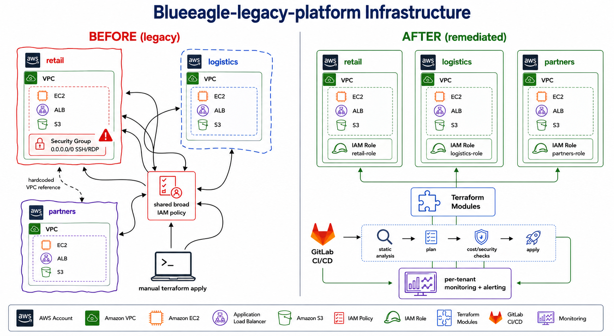

Terraform for the shared AWS Multi-Tenant platform supporting retail, logistics,
and partners.

Ask in the team channel if you need access. Each tenant's folder has
its own `main.tf` — cd into it and run `terraform apply`.

TODO: document the shared IAM policy setup properly.
TODO: someone should set up CI for this at some point.
TODO: update this README, it's out of date.
TODO: someone mentioned commits/branches should reference the ClickUp
ticket now (WANP-11XX, feature/WANP-11XX-<description>) — confirm and
actually document this somewhere real.

---

*This README is exactly as sparse as it would realistically be on a
platform like this — that's the point. Documenting what's actually
here, and why it's a problem, is part of the exercise. See the*
**Principal Infrastructure Engineer Exercise** *document for what
you're being asked to do with this repository.*

